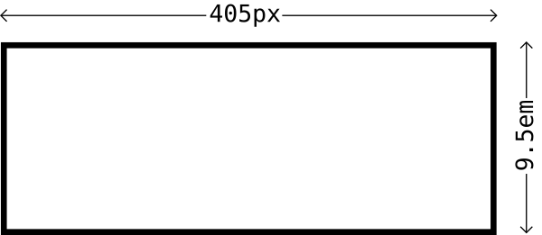
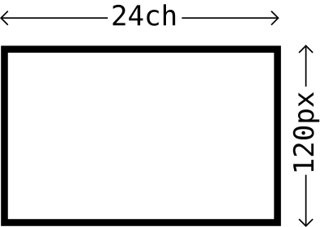

# Watched Box

**Declarative container queries FTW!**

A custom element as a `ResizeObserver` root. The easiest way to get working with `ResizeObserver` and creating [container queries](https://ethanmarcotte.com/wrote/on-container-queries/) with JavaScript. Unlike many implementations, you can use _any_ CSS length units.

## Get started

Just import the `watched-box.min.js` module, like so:

```js
import WatchedBox from './path/to/watched-box.min.js';
```

Then you can start wrapping your content in `<watched-box>` Custom Elements and defining `width` and `height` breakpoints:

```html
<watched-box widthBreaks="70ch, 900px" heightBreaks="50vh, 60em">
  <!-- HTML and text stuff here -->
</watched-box>
```

This will generate your classes, which take the following format (where a prefix is not supplied; see [Props](#props)):

* Less than or equal to the supplied **width**: `w-lte-[the width]`
* Greater than the supplied **width**: `w-gt-[the width]`
* Less than or equal to the supplied **height**: `h-lte-[the height]`
* Greater than the supplied **height**: `h-gt-[the height]`

Depending on the aspect ratio, one of the following classes will also be appended (where a prefix is not supplied; see [Props](#props)):

* `portrait`
* `landscape`
* `square`

## Examples

### Single breaks for each dimension

A box with a width of `405px` and a height of `9.5em`.



```html
<watched-box widthbreaks="405px" heightbreaks="9em" style="display: block;" class="w-lte-405px h-gt-9em landscape"></watched-box>
```

Note the `display: block` — custom elements are inline by default, but `<watched-box>` is used as a block.

### Multiple breaks for each dimension, using different units

A box with a width of `24ch` and a height of `120px`.



```html
<watched-box widthbreaks="9em, 800px" heightbreaks="405px, 10vh" style="display: block;" class="w-gt-9em w-lte-800px h-lte-405px h-gt-10vh landscape"></watched-box>
```

Note that units are dynamically converted for comparison, meaning you can mix them. Where the context's value for `1em` is `21px`, `<watched-box>` is aware that `3.1em` is longer than `63px` (`21px` * 3, or `3em`).

### Exploring relativity

This one is more complex, and shows the power of `<watched-box>`. The element has the following CSS:

```css
watched-box {
  font-size: 20em;
  width: 200px;
  height: 200px;
}
```

Note the large `20em` `font-size`. This is likely (depending on the context) to make `1em` _greater_ than `201px`, eliciting the `w-lte-1em` class as below.

```html
<watched-box widthbreaks="201px, 1em" heightbreaks="199px" style="display: block;" class="w-lte-201px w-lte-1em h-gt-199px square"></watched-box>
```

Here's the same result, but with the `prefix="wbx"` prop/value supplied:

```html
<watched-box widthbreaks="201px, 1em" heightbreaks="199px" prefix="wbx" style="display: block;" class="wbx-w-lte-201px wbx-w-lte-1em wbx-h-gt-199px wbx-square"></watched-box>
```

